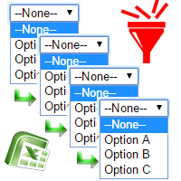

# Custom Control for Work Item Form

### Usage ###

1. Download the repository.
2. Open the Command Prompt and change to the directory where you cloned the project. 
3. Make This Steps : 
    1. Run `npm install` to install required dependencies.
    2. Run `npm install -g grunt` to install a global copy of grunt.
    3. Run `npm install -g tfx-cli`
    4. Check the category value in the 'vss-extension.json' file 
        1. "Plan and track" for TFS 2017
        2. "Azure Boards" for TFS 2019
    5. Run `grunt package-dev`.
    6. Navigate to your TFS. and Go to Marketplace. 
    7. Click "Browse local extensions".
    8. Scroll down and click on the "Manage Extensions".
    9. Click "Upload new extension".
    10. Drag and Drop the generated file from your packaged project (vsix). 
    11. Click "Upload".
    12. Hover over the extension when it appears in the list, and click "Install".

You have now installed the extension inside your collection.  
You are now able to put the control in the work item form.

# Deffine the extension in Azure DevOps

There is nine Inputs parameters, four of them are optional.
Control Name : this is the name of the control (you can put more then one), and it use this name to save the list
               values in the storage, so it is importent to put logic names.
FieldName (1-4) : this is the field name (that what the user see)
Field(1-4) : this is the value that the user select.
fieldName and Field 3/4 are optional (if you want to cascade more the 2 lists).

# Create CSV File

Create Your CSV file, you can put thousend of values
pay attenshion to write the values correctly, and do not add spaces in the end of the value
save the file ... file name must be as the name of the control name -> controlName.csv

# Upload the CSV file

use the action menu added in the work item Form.
"Upload Dependencies"

# Use your Controller

# If you still working with xml

set your fields

set the extenshion

add the control to the view

Contact me avih75@gmail.com