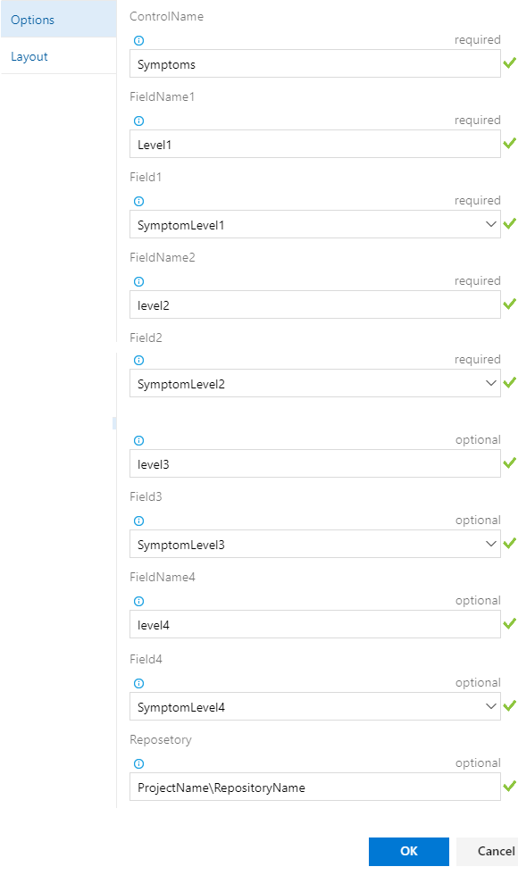
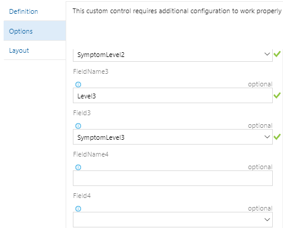
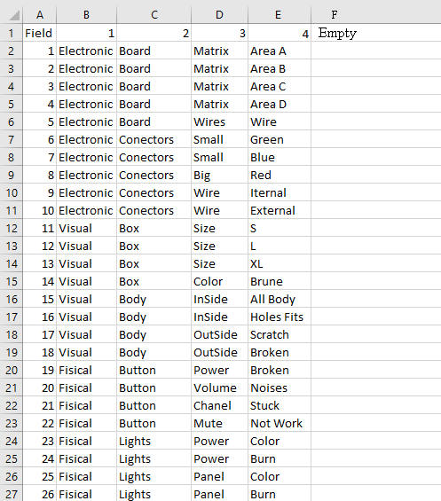
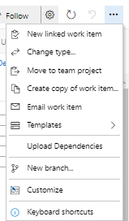
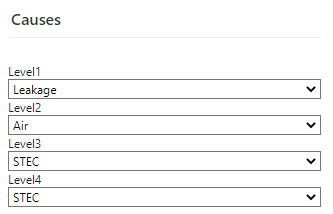
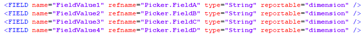
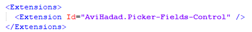
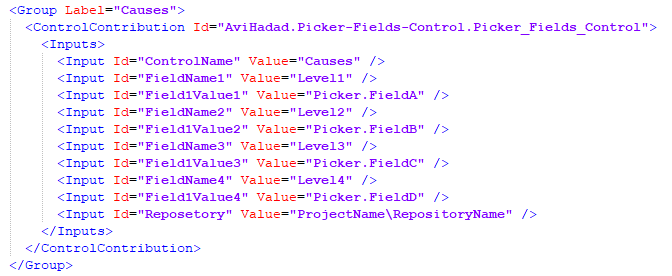

Summary : This control is designed to allow the user to create lists of selectable values ​​that depend on other lists. Currently the control is capable of concatenating 2 to 4 lists.
Most of you used to use the global list when working with xml, but when there are many dependencies between several fields, many lists are created and the code in xml gets complicated, and the global list became huge.
Also, when we work in cloud, the use of the global list its not avaliable
I believe some of you have found other solutions and other extensions. This extension is built for a specific additional need, and its to upload the dependent lists by a simple CSV file. So they can be easily managed.
In this extension, i use the stack service of the Azure DevOps (TFS);

# Deffine the extension in Azure DevOps

There is nine Inputs parameters, four of them are optional.
Control Name : this is the name of the control (you can put more then one), and it use this name to save the list
               values in the storage, so it is importent to put logic names.
FieldName (1-4) : this is the field name (that what the user see)
Field(1-4) : this is the value that the user select.
fieldName and Field 3/4 are optional (if you want to cascade more the 2 lists).

# Create CSV File

Create Your CSV file, you can put thousend of values
pay attenshion to write the values correctly, and do not add spaces in the end of the value
save the file ... file name must be as the name of the control name -> controlName.csv

# Upload the CSV file

use the action menu added in the work item Form.
"Upload Dependencies"

# Use your Controller

# If you still working with xml

set your fields

set the extenshion

add the control to the view

Contact me avih75@gmail.com