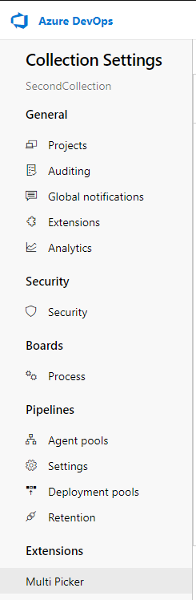
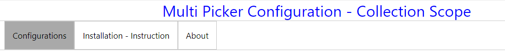
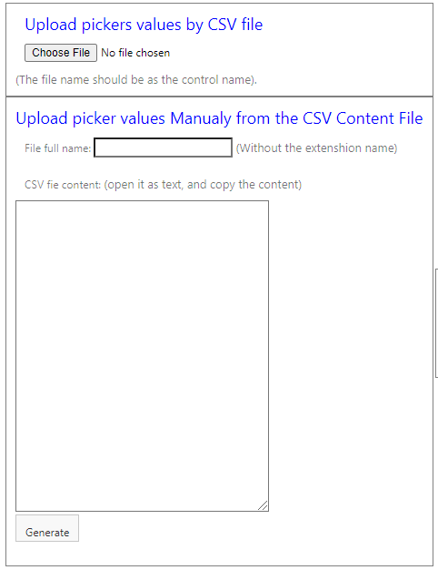
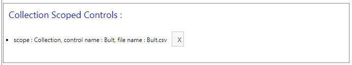
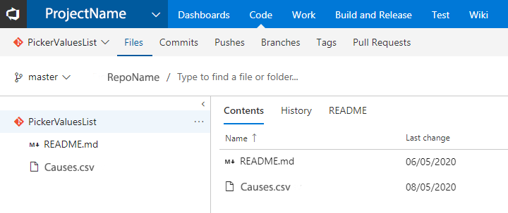
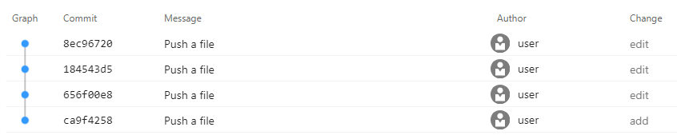

Summary : This control is designed to allow the user to create lists of selectable values ​​that depend on other lists. Currently the control is capable of concatenating 2 to 4 lists.
Most of you used to use the global list when working with xml, but when there are many dependencies between several fields, many lists are created and the code in xml gets complicated, and the global list became huge.
Also, when we work in cloud, the use of the global list its not avaliable.
This extension is built for a specific additional need, and its to upload the dependent lists by a simple CSV file. So they can be easily be managed.the control can push to git the csv file every time you upload it.
In this extension, i use the stack service of the Azure DevOps (TFS);

# updates :
   * update 1.1.308, i added path field, that  contain the all values cacade with \ - for queries mostly
   * ipdate 1.1.315, i added Behaviour parameter - to give it more oprtion
    - Auto : fill automaticly if there is only one option

# Define the extension in Azure DevOps

There is ten Inputs parameters, four of them are optional.
Control Name    : this is the name of the control (you can put more then one in work item),
                  and it use this name to save the list values in the storage, so it is importent to put logic names.
FieldName (1-4) : this is the field name that effects on the user sees view only.
Field(1-4)      : this is the value that the user pickes, need to get field of the work item.
Reposetory      : this use for save the csv file in git version control. (optional).
                  to use this feature just insert the project name and the reposetory name that you want to save the file in it. (ProjectName\ReposetoryName)
FieldName (3,4) and Field (3,4) are optional (if you want to cascade more the 2 lists).

 

# Handle the Csv file
## Create CSV File

Create Your CSV file, you can put thousend of values
pay attenshion to write the values correctly, avoid adding spaces in the end of the value (will create new value, its a string)
the cvs file name can also set the projectName, so each project can use deffrent lists (if you want to use same control name)
save the file :
                file name must be as the name of the control (name -> controlName.csv), that deffine this list as an generic list for all the controls that have this name.
                if you want a specific list for a project, make shure you save the file name with the project name (name -> controlName_projectName.csv), it looks for a specific project first, and if not, he looks for the generic list.

## Upload the CSV file

Go to Collection setting, Multi picker. 

Select the Configuration pad

Two option to upload the file
upload the file (works only in chrome), or upload manualy the file content.

you can see the control list you have uploaded its files, and remove it from there.

# Use your Controller

# If you still working with xml

set your fields

set the extenshion

add the control to the view

# Keep your lists values under Git 

just create in any project new repository
add the parameters to repostitory field in the control "ProjectName\RepositoryName"

any time you upload a values list file to the system, it will be pushed to the git

Contact me avih75@gmail.com
